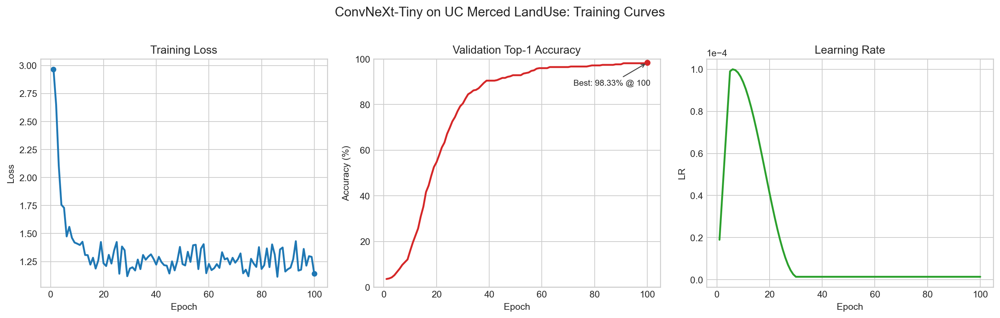

# 课程作业实验报告

## 一、基本信息

| 项目 | 内容 |
| --- | --- |
| 课程名称 | `ECE / Exercise 1` |
| 实验题目 | 基于 ConvNeXt-Tiny 的 UC Merced LandUse 场景分类 |
| 实验平台 | Linux + PyTorch + MMPretrain |
| 学生姓名 | `__________` |
| 学号 | `__________` |
| 完成日期 | `2026-04-18` |

## 二、摘要

本实验基于 OpenMMLab 的 MMPretrain 框架，使用在 ImageNet 上预训练的 ConvNeXt-Tiny 模型，对 UC Merced LandUse 遥感场景数据集进行迁移学习与微调。实验首先对原始数据集进行 8:2 划分，构建训练集与验证集，并通过标注文件完成样本索引。随后在单张 NVIDIA GeForce RTX 4090 上完成 100 轮训练，采用 AdamW 优化器、线性预热与余弦退火学习率调度，并结合 RandAugment、RandomErasing、Mixup、CutMix 等增强策略提升模型泛化能力。实验结果表明，模型在验证集上取得了 98.33% 的 Top-1 分类精度，说明基于预训练模型的微调方案在小样本遥感场景分类任务上具有良好的有效性与稳定性。

**关键词：** 遥感场景分类；ConvNeXt-Tiny；迁移学习；MMPretrain；UC Merced LandUse

## 三、实验目的

本实验的目标是完成 UC Merced LandUse 数据集上的 21 类遥感场景分类任务，并通过完整的训练日志分析模型的收敛过程、性能变化和最终效果。具体目标包括：

1. 基于 MMPretrain 框架构建可运行的图像分类训练流程。
2. 使用预训练 ConvNeXt-Tiny 模型对小规模遥感数据集进行微调。
3. 分析训练损失、验证精度和学习率随 epoch 的变化趋势。
4. 评估模型在验证集上的最终识别性能，并形成实验结论。

## 四、数据集与预处理

### 4.1 数据集简介

UC Merced LandUse 是一个典型的遥感场景分类数据集，共包含 21 个场景类别，每类 100 张图像，图像分辨率统一，类别覆盖农业区、飞机场、海滩、森林、港口、停车场、跑道等典型地物场景。

本实验使用的 21 个类别如下：

- agricultural
- airplane
- baseballdiamond
- beach
- buildings
- chaparral
- denseresidential
- forest
- freeway
- golfcourse
- harbor
- intersection
- mediumresidential
- mobilehomepark
- overpass
- parkinglot
- river
- runway
- sparseresidential
- storagetanks
- tenniscourt

### 4.2 数据划分方式

实验采用固定 8:2 的划分比例：

- 训练集：每类 80 张，共 1680 张
- 验证集：每类 20 张，共 420 张

根据数据检查脚本的验证结果，训练集与验证集目录完整，所有类别均无缺失，`train.txt` 与 `val.txt` 两个标注文件正确生成，样本数量与标签编号均符合预期。

## 五、实验环境与方法

### 5.1 软硬件环境

| 项目 | 配置 |
| --- | --- |
| 操作系统 | Linux |
| Python | 3.10.20 |
| PyTorch | 2.11.0 + cu126 |
| MMEngine | 0.10.7 |
| MMCV | 2.2.0 |
| MMPretrain | 1.2.0 |
| GPU | NVIDIA GeForce RTX 4090 |

### 5.2 模型与训练参数

本实验采用 ConvNeXt-Tiny 作为主干网络，并加载 ImageNet 预训练权重进行微调。主要训练参数如下：

| 参数 | 设置 |
| --- | --- |
| 主干网络 | ConvNeXt-Tiny |
| 分类类别数 | 21 |
| 输入尺寸 | 224 × 224 |
| Batch Size | 16 |
| 优化器 | AdamW |
| 初始学习率 | 1e-4 |
| 权重衰减 | 0.05 |
| 学习率调度 | 5 轮线性预热 + 100 轮余弦退火 |
| 总训练轮数 | 100 |
| 验证间隔 | 每轮验证一次 |

### 5.3 数据增强策略

训练阶段采用如下增强方法：

- RandomResizedCrop
- RandomFlip
- RandAugment
- RandomErasing
- Mixup
- CutMix
- Label Smoothing
- EMAHook

测试阶段采用 ResizeEdge 与 CenterCrop 的标准评估流程，以保证验证结果的稳定性和可比性。

## 六、实验结果

### 6.1 关键结果

实验最终在验证集上取得如下结果：

| 指标 | 结果 |
| --- | --- |
| 最佳 Top-1 Accuracy | **98.33%** |
| 最佳轮次 | **Epoch 100** |
| 最佳权重文件 | `best_accuracy_top1_epoch_100.pth` |
| 最终权重文件 | `epoch_100.pth` |

验证集共包含 420 张图像，因此 98.33% 的准确率约对应 **413 张图像被正确分类**。这一结果表明，ConvNeXt-Tiny 在该遥感场景分类任务上具有很强的表征能力。

### 6.2 阶段性精度变化

根据训练日志与标量文件统计，验证集 Top-1 精度的代表性变化如下：

| Epoch | Val Top-1 Accuracy |
| --- | --- |
| 1 | 3.57% |
| 5 | 6.67% |
| 10 | 15.95% |
| 20 | 54.76% |
| 30 | 80.48% |
| 40 | 90.48% |
| 50 | 92.86% |
| 60 | 95.95% |
| 70 | 96.43% |
| 80 | 97.14% |
| 90 | 97.62% |
| 100 | 98.33% |

### 6.3 阶段性损失变化

训练损失的典型变化如下：

| Epoch | Train Loss |
| --- | --- |
| 1 | 2.9663 |
| 5 | 1.7300 |
| 10 | 1.4097 |
| 20 | 1.2341 |
| 30 | 1.1878 |
| 60 | 1.2289 |
| 80 | 1.1838 |
| 100 | 1.1407 |

从结果看，训练损失在初期快速下降，后期在 1.1 至 1.3 区间内波动。这种现象与 Mixup、CutMix、Label Smoothing 和 RandomErasing 等增强方法有关。在此设置下，损失值不会单调下降至极低水平，但模型的泛化性能会明显增强，因此验证精度仍能持续提升。

## 七、训练曲线分析

图 1 给出了整个训练过程中的训练损失、验证精度和学习率变化情况。

**图 1 训练损失、验证精度与学习率变化曲线**

结合图 1 与日志记录，可以得到以下分析：

1. 在第 1 到第 10 轮之间，模型处于任务适应阶段，验证精度从 3.57% 提升到 15.95%，说明分类头和高层特征正在快速调整。
2. 在第 10 到第 30 轮之间，模型进入快速收敛阶段，验证精度由 15.95% 提升到 80.48%，是整个训练过程中提升最显著的区间。
3. 在第 30 到第 60 轮之间，验证精度继续由 80.48% 提升到 95.95%，说明模型已经学到较为稳定的场景判别特征。
4. 在第 60 到第 100 轮之间，模型仍然持续提升，最终达到 98.33%。虽然提升幅度小于中前期，但后半段训练仍然有效。

进一步统计可得到几个关键节点：

- 首次达到 80%：第 30 轮
- 首次达到 90%：第 39 轮
- 首次达到 95%：第 57 轮
- 首次达到 98%：第 91 轮

从学习率变化曲线可以看出，学习率在前 5 轮完成线性预热后进入余弦退火阶段，并在后半程降至约 `1.39e-6` 的极低水平。此时模型训练更接近低学习率精调过程，这也是后期精度能够继续稳定提升的重要原因。

## 八、结果讨论

本实验结果表明，ConvNeXt-Tiny 在 UC Merced LandUse 数据集上表现优异，主要原因包括以下几点：

1. 使用 ImageNet 预训练权重显著缩短了收敛时间，使模型能够在小样本数据集上快速获得较高精度。
2. 丰富的数据增强策略改善了模型对场景变化的鲁棒性，降低了过拟合风险。
3. 训练轮数从 30 轮扩展到 100 轮后，模型性能继续明显提升，说明在本任务中较长训练周期是有价值的。
4. 后期虽然训练损失下降不明显，但验证精度持续提升，说明当前优化目标更偏向提升泛化能力，而不是单纯降低训练集损失。

总体来看，本实验训练过程稳定，模型无明显震荡或退化现象，说明配置与数据集匹配较好。

## 九、结论

本实验基于 MMPretrain 框架，成功实现了 ConvNeXt-Tiny 在 UC Merced LandUse 遥感场景分类数据集上的迁移学习训练。通过 100 轮训练，模型在验证集上取得了 98.33% 的 Top-1 准确率，验证了预训练视觉模型在小规模遥感场景分类任务中的高效性。

本实验可以得出以下结论：

1. 迁移学习能够有效提升遥感图像分类任务的性能与训练效率。
2. ConvNeXt-Tiny 在 UC Merced 数据集上具有很强的特征提取能力和良好的泛化性能。
3. 适当延长训练轮数并结合多种增强策略，有助于进一步挖掘模型性能上限。

## 十、可改进方向

为进一步完善实验，可在后续工作中尝试以下方向：

1. 与 ResNet、ViT 等主干网络进行横向对比，分析不同模型结构的优缺点。
2. 增加混淆矩阵和错误样本可视化，以观察模型对易混类别的识别情况。
3. 调整学习率退火策略，使后半程训练的衰减过程更加平滑。
4. 采用多次随机划分实验，统计平均准确率与标准差，以提高结果的稳健性。

## 十一、实验产出文件

本次实验保留的关键文件如下：

- 最优权重：`exercise1/work_dirs/convnext_tiny_ucmerced/best_accuracy_top1_epoch_100.pth`
- 最终权重：`exercise1/work_dirs/convnext_tiny_ucmerced/epoch_100.pth`
- 最终配置：`exercise1/work_dirs/convnext_tiny_ucmerced/convnext_tiny_ucmerced.py`
- 训练日志：`exercise1/work_dirs/convnext_tiny_ucmerced/*/*.log`
- 标量数据：`exercise1/work_dirs/convnext_tiny_ucmerced/*/vis_data/scalars.json`
- 曲线图：`exercise1/training_curves_convnext_ucmerced.png`
